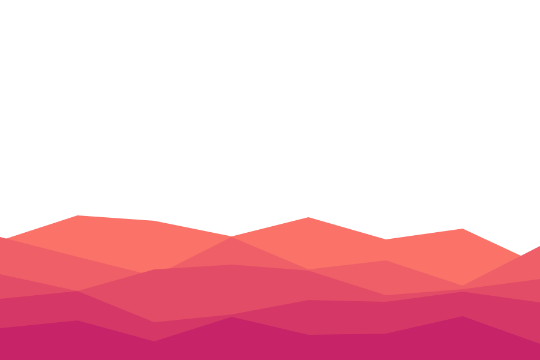

<h1 align="center" id="title">
  
</h1>

  

<h2 align="center">About 📖</h2>

EZVeto is a professional CS2 map veto system designed to streamline the competitive map selection process. Built with modern web technologies, it offers an intuitive interface for teams to ban and pick maps following official tournament rules.

<h2 align="center">Features 🚀</h2>

- **Multiple Match Formats**
  - Best of 1 (BO1)
  - Best of 3 (BO3)
  - Best of 5 (BO5)

- **Fair Team Assignment**
  - Randomized coin flip system
  - Unbiased team selection
  - Clear turn indicators

- **Professional Veto Process**
  - Standard tournament rules
  - Interactive map selection
  - Real-time ban/pick tracking

- **Side Selection**
  - Team-based side picks
  - CT/T side assignment
  - Competitive format rules

<h2 align="center">Technologies Used 💻</h2>

<h2 align="center">Screenshots 📸</h2>

  <h3>Format Selection</h3>
  
  
  <h3>Map Veto Phase</h3>
  
  
  <h3>Side Selection</h3>
  

<h2 align="center">Getting Started 🎮</h2>

1. Visit [EZVeto](https://your-deployment-url.com)
2. Select your match format (BO1/BO3/BO5)
3. Use the coin flip for team assignment
4. Follow the veto process
5. Select starting sides
6. Get your match summary

<h2 align="center">Connect With Me 🤝</h2>

<h2 align="center">Project Stats 📊</h2>

<h2 align="center">License 📄</h2>

This project is licensed under the MIT License. See the [LICENSE](LICENSE) file for details.

---

